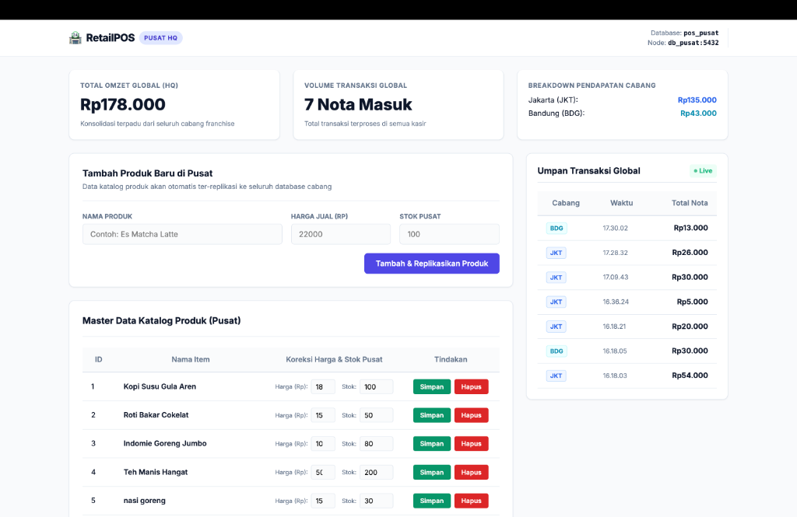

# Sistem Basis Data Terdistribusi (SBDT): POS Multi-Cabang

Sistem basis data terdistribusi untuk jaringan Point of Sale (POS) franchise kasir multi-cabang dengan **1 Node Pusat (HQ)** dan **2 Node Cabang (Jakarta & Bandung)**. Setiap node menggunakan instance database PostgreSQL tersendiri dalam wadah Docker Container.

---

## 👨‍🎓 Informasi Mahasiswa

* **Nama**: Adam Bagaskara
* **NIM**: 20220801522
* **Program Studi**: Teknik Informatika
* **Fakultas**: Ilmu Komputer
* **Perguruan Tinggi**: Universitas Esa Unggul

---

## 💡 Konsep SBDT yang Diimplementasikan

| Konsep SBDT | Implementasi pada Sistem POS |
|---|---|
| **Fragmentasi Horizontal** | Tabel `penjualan`, `detail_penjualan`, dan `stok` diisolasi per cabang (Jakarta & Bandung). Cabang hanya menyimpan data lokal. |
| **Replikasi Logikal** | Master data `produk` & `cabang` direplikasi 1 arah dari Pusat ke seluruh cabang secara real-time via PostgreSQL Logical Replication (*Publisher-Subscriber*). |
| **Distributed Query (FDW)** | Node Pusat membaca & mengagregasikan data transaksi dari cabang secara terpusat menggunakan `postgres_fdw` untuk tampilan Dashboard HQ. |
| **Transparansi Lokasi** | Aplikasi web di cabang dan pusat mengakses view/koneksi tanpa perlu mengetahui letak fisik lokasi server database asli. |
| **Fault Tolerance & Offline Mode** | Jika koneksi antar-node terputus (offline), transaksi kasir di cabang tetap berjalan 100% lancar secara lokal. |
| **Eventual Consistency** | Middleware *Sync Agent* secara otomatis melakukan pendataan dan pengiriman data transaksi lokal yang tertunda begitu koneksi pusat pulih. |

---

## 🏗️ Arsitektur Sistem

```text
                     +-------------------------------+
                     |      NODE PUSAT (HQ)          |
                     |       Port: 5431 / 5432       |
                     |  Master Data: produk, cabang  |
                     |  Global View (postgres_fdw)   |
                     +---------------+---------------+
                                     |
              +----------------------+----------------------+
              | Logical Replication  | Logical Replication  |
              v (Master Produk)      v (Master Produk)      |
    +-------------------------+   +-------------------------+
    |   NODE CABANG JAKARTA   |   |   NODE CABANG BANDUNG   |
    |    Port: 5433 / 5432    |   |    Port: 5434 / 5432    |
    |  Fragmen: stok,         |   |  Fragmen: stok,         |
    |  penjualan (JKT)        |   |  penjualan (BDG)        |
    +-------------------------+   +-------------------------+
                 ^                             ^
                 | (Sync Agent Asinkron)       | (Sync Agent Asinkron)
                 +-----------------------------+
```

---

## 📁 Struktur Direktori

```text
UAS-20220801522/
├── README.md                           # Dokumentasi utama proyek
├── Laporan_SBDT.pdf                    # Laporan lengkap Tugas Akhir / Jurnal (PDF)
├── Laporan_SBDT.docx                   # Laporan lengkap Tugas Akhir / Jurnal (Word .docx)
├── presentasi_SBDT.pptx                # File Presentasi PowerPoint (.pptx)
├── presentasi_SBDT (1).pdf             # File Presentasi dalam format PDF
├── img/                                # Tangkapan layar dan diagram pengujian
│   ├── dashboard_hq.png
│   ├── kasir_jkt.png
│   ├── kasir_bdg.png
│   ├── pgadmin_detail_transaksi.png
│   └── pgadmin_produk.png
└── src/                                # Source Code Utama
    ├── Dockerfile                      # Build environment Node.js & Python
    ├── docker-compose.yml              # Konfigurasi multi-container Docker
    ├── package.json                    # Dependensi Node.js web app
    ├── simulate.py                     # Skrip otomatisasi pengujian & setup DB
    ├── sync_agent.js                   # Middleware Sync Agent (Node.js)
    ├── sync_agent.py                   # Middleware Sync Agent (Python)
    ├── sql/                            # Skrip Inisialisasi Database
    │   ├── init-pusat.sql              # Skema HQ & Publisher Replikasi
    │   ├── init-cabang-jkt.sql         # Skema JKT, Subscriber & Transaksi
    │   └── init-cabang-bdg.sql         # Skema BDG, Subscriber & Transaksi
    └── web_app/                        # Aplikasi Web Express.js
        ├── app.js                      # Entry point Express.js
        ├── config/                     # Konfigurasi koneksi database
        ├── routes/                     # Router Kasir & Dashboard HQ
        ├── views/                      # Template EJS UI
        └── public/                     # CSS & Static assets
```

---

## 🚀 Cara Menjalankan Proyek

### Prasyarat
* Docker Desktop & Docker Compose
* Node.js v18+ & Python 3.9+

### Langkah-Langkah Menjalankan (Docker):

1. Masuk ke direktori `src`:
   ```bash
   cd UAS-20220801522/src
   ```

2. Jalankan seluruh service kluster database dan aplikasi:
   ```bash
   docker compose up -d
   ```

3. Inisialisasi skema database dan replikasi:
   ```bash
   python3 simulate.py setup
   python3 simulate.py seed
   ```

4. Akses Aplikasi melalui Browser:
   * **Dashboard Pusat (HQ)**: `http://localhost:8080`
   * **Kasir Cabang Jakarta**: `http://localhost:8081`
   * **Kasir Cabang Bandung**: `http://localhost:8082`
   * **pgAdmin Web UI**: `http://localhost:5050` (Email: `admin@sbdtpos.com` | Pass: `adminpassword`)

---

## 🖼️ Tangkapan Layar Sistem

### 1. Dashboard Pusat (HQ)


### 2. Antarmuka Kasir Jakarta & Bandung


### 3. Monitoring pgAdmin & Transaksi


---

## 📊 Skenario Pengujian SBDT

1. **Uji Replikasi Logikal**: Tambahkan produk baru di Dashboard Pusat (`localhost:8080`). Produk secara instan muncul di Kasir Jakarta (`:8081`) dan Bandung (`:8082`).
2. **Uji Fragmentasi Horizontal**: Lakukan transaksi di Kasir Jakarta. Data transaksi tercatat hanya di database Cabang Jakarta (`pos_jkt`), tidak bercampur dengan Cabang Bandung.
3. **Uji Offline Mode & Fault Tolerance**: Matikan node pusat (`docker stop db_pusat`). Kasir Jakarta dan Bandung tetap dapat memproses transaksi penjualan tanpa kendala.
4. **Uji Eventual Consistency**: Nyalakan kembali node pusat (`docker start db_pusat`). Sync Agent secara otomatis menyinkronkan seluruh transaksi tertunda ke pusat.

---

© 2026 Adam Bagaskara (20220801522) - Universitas Esa Unggul.
