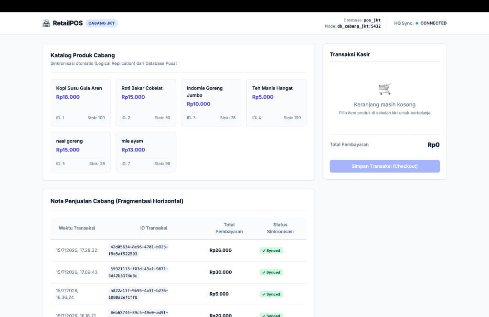
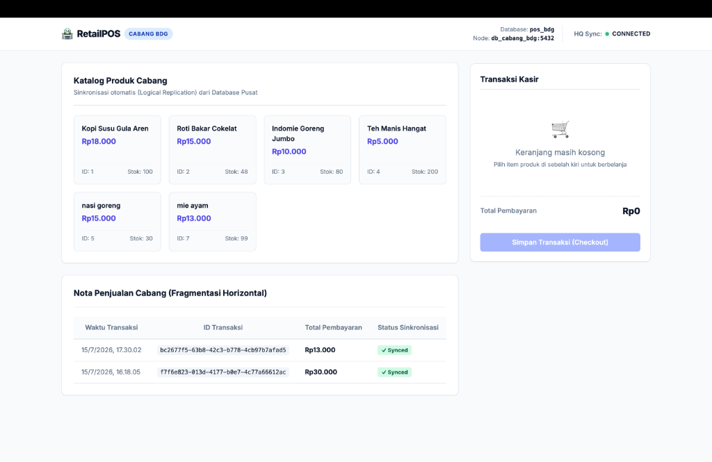
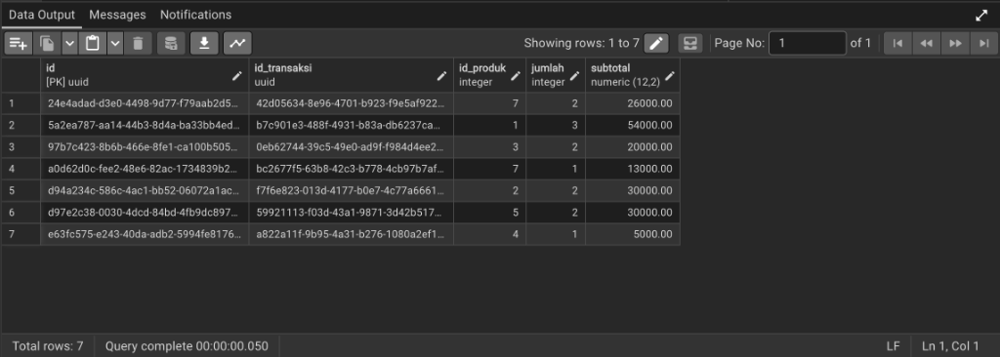
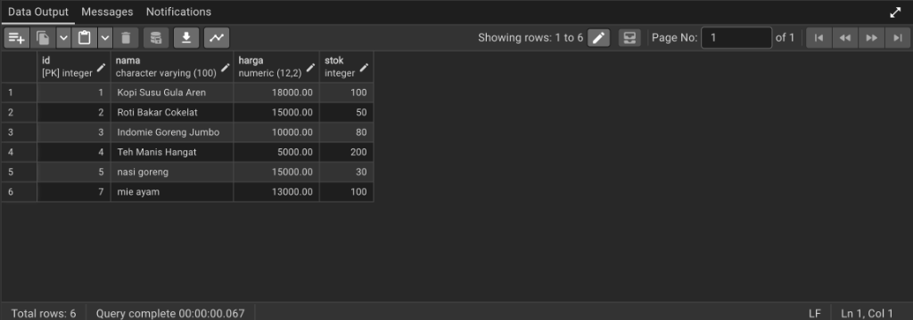

# Walkthrough: Distributed POS Database Simulation (Clean Code)

Berikut adalah panduan cepat untuk menjalankan dan mendemonstrasikan sistem kasir terdistribusi Anda. Anda dapat memilih salah satu dari dua metode di bawah ini:

---

## Opsi 1: Menjalankan Full di Docker (Rekomendasi / Paling Mudah)
Gunakan metode ini jika Anda ingin menjalankan seluruh sistem (database, aplikasi web, dan sync agent) secara otomatis di dalam Docker tanpa perlu membuka banyak tab terminal.

1. Pastikan aplikasi **Docker Desktop** sudah menyala.
2. Buka terminal di folder proyek `/Users/project_gabut/sbdt_pos_terdistribusi` dan jalankan:
   ```bash
   docker compose up -d
   ```
3. Lakukan inisialisasi skema basis data awal dan replikasi:
   ```bash
   source venv/bin/activate
   python simulate.py setup
   python simulate.py seed
   ```
4. Buka browser Anda di tab terpisah:
   * **Dashboard Pusat**: http://localhost:8080
   * **Kasir Jakarta**: http://localhost:8081
   * **Kasir Bandung**: http://localhost:8082
   * **pgAdmin (Web Database)**: http://localhost:5050 (Login: `admin@sbdtpos.com` / `adminpassword`)

---

## Opsi 2: Menjalankan Aplikasi Web Secara Manual (Untuk Ujian/Demo Kode)
Gunakan metode ini jika Anda ingin menunjukkan kode Node.js Anda berjalan secara live di terminal lokal mesin host Anda.

1. Jalankan **hanya database dan pgAdmin** di Docker:
   ```bash
   docker compose up -d db_pusat db_cabang_jkt db_cabang_bdg pgadmin
   ```
2. Jalankan inisialisasi skema dan seed produk awal:
   ```bash
   source venv/bin/activate
   python simulate.py setup
   python simulate.py seed
   ```
3. Pastikan dependensi Node.js lokal sudah terpasang:
   ```bash
   npm install
   ```
4. Buka **4 tab terminal baru di VS Code** (klik ikon `+` di kanan atas panel terminal) dan jalankan masing-masing perintah berikut:

   * **Terminal Tab 1 (Dashboard Pusat / HQ)**:
     ```bash
     cd /Users/project_gabut/sbdt_pos_terdistribusi && APP_TYPE=pusat DB_NAME=pos_pusat DB_PORT=5431 PORT=8080 node web_app/app.js
     ```
   * **Terminal Tab 2 (Kasir Jakarta / JKT)**:
     ```bash
     cd /Users/project_gabut/sbdt_pos_terdistribusi && APP_TYPE=cabang BRANCH_NAME=JKT DB_NAME=pos_jkt DB_PORT=5433 PORT=8081 node web_app/app.js
     ```
   * **Terminal Tab 3 (Kasir Bandung / BDG)**:
     ```bash
     cd /Users/project_gabut/sbdt_pos_terdistribusi && APP_TYPE=cabang BRANCH_NAME=BDG DB_NAME=pos_bdg DB_PORT=5434 PORT=8082 node web_app/app.js
     ```
   * **Terminal Tab 4 (Sync Agent)**:
     ```bash
     cd /Users/project_gabut/sbdt_pos_terdistribusi && node sync_agent.js
     ```
5. Buka browser di tab terpisah:
   * **Dashboard Pusat**: http://localhost:8080
   * **Kasir Jakarta**: http://localhost:8081
   * **Kasir Bandung**: http://localhost:8082
   * **pgAdmin (Web Database)**: http://localhost:5050 (Login: `admin@sbdtpos.com` / `adminpassword`)

---

## Panduan Menghubungkan pgAdmin ke Database
Setelah membuka `http://localhost:5050` di browser dan login dengan email `admin@sbdtpos.com` dan password `adminpassword`, klik kanan **Servers** -> **Register** -> **Server...** untuk mendaftarkan database:

* **Database Pusat**:
  * Name: `Pusat HQ`
  * Host name: `db_pusat`
  * Port: `5432`
  * Maintenance database: `pos_pusat`
  * Username / Password: `postgres` / `supersecretpassword` (Centang *Save password?*)
* **Database Jakarta**:
  * Name: `Cabang JKT`
  * Host name: `db_cabang_jkt`
  * Port: `5432`
  * Maintenance database: `pos_jkt`
  * Username / Password: `postgres` / `supersecretpassword` (Centang *Save password?*)
* **Database Bandung**:
  * Name: `Cabang BDG`
  * Host name: `db_cabang_bdg`
  * Port: `5432`
  * Maintenance database: `pos_bdg`
  * Username / Password: `postgres` / `supersecretpassword` (Centang *Save password?*)

---

## Skenario Demo Pengujian SBDT

### SKENARIO 1: Pembuktian Replikasi Logikal (Pusat -> Cabang)
1. Buka Dashboard Pusat (`localhost:8080`), tambahkan produk baru (misal: `Es Matcha Latte`, harga `22000`, stok `100`).
2. Klik **Tambah & Replikasikan Produk**.
3. Buka Kasir Jakarta (`localhost:8081`) & Kasir Bandung (`localhost:8082`).
4. **Hasil**: Produk otomatis tampil di menu kasir cabang dan di tabel `produk` database JKT dan BDG (pgAdmin) secara instan.

### SKENARIO 2: Pembuktian Fragmentasi Horizontal (Cabang -> Pusat)
1. Buka Kasir Jakarta (`localhost:8081`), lakukan checkout (pembelian Kopi Susu).
2. Periksa pgAdmin:
   * Di `Cabang JKT` -> tabel `transaksi` -> muncul data transaksi baru.
   * Di `Cabang BDG` -> tabel `transaksi` -> kosong. Ini membuktikan **Fragmentasi Horizontal**.
   * Di `Pusat HQ` -> tabel `transaksi` -> data transaksi JKT otomatis terkirim dalam waktu 1 detik oleh `sync_agent.js`.

### SKENARIO 3: Fault Tolerance & Eventual Consistency (Mode Offline)
1. Matikan database Pusat melalui terminal:
   ```bash
   docker stop db_pusat
   ```
2. Status di pojok kanan atas kasir cabang akan berubah menjadi merah (**HQ Sync: DISCONNECTED**).
3. Lakukan checkout di Kasir Jakarta. Transaksi sukses di tingkat cabang dan kolom `is_synced` pada tabel `transaksi` Cabang JKT (pgAdmin) berstatus `false`.
4. Nyalakan kembali database Pusat:
   ```bash
   docker start db_pusat
   ```
5. Dalam 1 detik, kolom `is_synced` di database cabang berubah menjadi `true` dan datanya masuk ke database Pusat secara otomatis.

---

## 5. Dokumentasi Screenshot Hasil Implementasi

Berikut adalah dokumentasi visual hasil eksekusi program di browser dan pgAdmin:

### A. Tampilan Web Dashboard Pusat (HQ)
Dashboard ini terhubung langsung ke database `db_pusat`. Menampilkan total omzet terkonsolidasi, volume transaksi global, grafik breakdown pendapatan cabang Jakarta & Bandung, dan riwayat transaksi real-time.


### B. Tampilan Web Kasir Cabang Jakarta (JKT)
Digunakan oleh Kasir JKT untuk melayani transaksi lokal. Menampilkan katalog produk lokal hasil replikasi dan daftar nota lokal JKT.


### C. Tampilan Web Kasir Cabang Bandung (BDG)
Digunakan oleh Kasir BDG untuk melayani transaksi lokal secara independen.


### D. Struktur Transaksi Cabang pada pgAdmin 4
Inspeksi tabel `detail_transaksi` di pgAdmin membuktikan bahwa setiap item belanja dicatat dengan kunci relasi UUID yang unik secara global untuk mencegah bentrokan ID.


### E. Replikasi Katalog Produk pada pgAdmin 4
Menunjukkan data katalog produk tersinkronisasi secara otomatis di seluruh node cabang (Jakarta & Bandung) dari database pusat.

